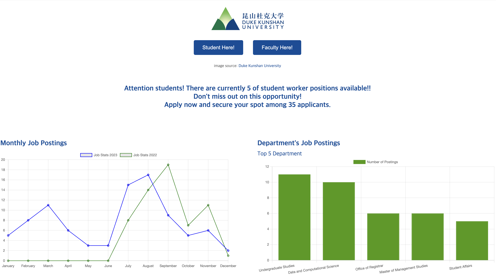

# Project-(CS310)DKU Career Service Center Web Application

## Technologies Used
### Backend Development
- **Python**
- **Django**: Employed as the web framework for rapid development and seamless integration with the database.
- **MySQL**: Used for efficient database management.

### Frontend Development
- **HTML**: Provided the structure of the web pages.
- **CSS**: Applied for styling and design.
- **JavaScript**: Added interactivity to enhance user experience.

This project utilized a full-stack approach, integrating both backend (server-side logic) and frontend (user interface) technologies to create a cohesive web application.

---

## Team Members
- **CO'25 Temirlan Sabyrbayev**
- **CO'26 Gihun Lee**

---

## Duration and Goals
### Project Duration
- Completed over a period of **four weeks** (November ~ December 2023).

### Project Goals

The primary goal was to transform a cumbersome 300-line Google spreadsheet into a user-friendly web application powered by a MySQL database. The DKU Career Service Center initially managed student work information through Google spreadsheets, which presented several challenges:
1. Users had to open separate browser tabs for each position.
2. Lack of essential filtering options made searching inefficient.
3. Manual management of job postings led to outdated status information.

### Solution
To address these issues, the team developed a web platform that enables DKU students and faculty to:
- **Search and filter student worker positions easily.**
- **Apply directly through the website.**
- **Manage application statuses, conduct interviews, and streamline the hiring process with faculty authentication.**
- **Access statistical information about job postings.**

This platform significantly improved the efficiency and usability of managing student worker positions at DKU.

#### Student Features

#### Faculty Features

   
   

## My Contributions

As a key contributor to the project, I was responsible for the following tasks:

1. **Collaboration with DKU Career Service Center**
   - Contacted the DKU Career Service Center to obtain the original Google spreadsheet file containing student work information.

2. **Database Design and Implementation**
   - Designed and created the relational database structure in **MySQL** to efficiently store and manage job postings, applications, and related data.

3. **Backend Development**
   - Selected **Django** as the web framework for its rapid development capabilities and seamless integration with MySQL.
   - Developed backend code to handle:
     - Client-server interactions.
     - Database connections.
     - Complex queries for filtering, statistical analysis, and data retrieval.

4. **Feature Development**
   - Implemented key features for the platform, including:
     - **Filter Options**: Enabled users to search and filter job postings based on specific criteria.
     - **Authentication**: Designed secure authentication mechanisms for faculty and students.
     - **Statistical Information**: Developed functionality to display statistical insights about job postings.
     - **Job Posting Management**: Added features for faculty to delete and add job postings efficiently.

Through these contributions, I played a pivotal role in transforming a cumbersome spreadsheet-based system into a streamlined web application that significantly improved usability and efficiency for DKU students and faculty.

